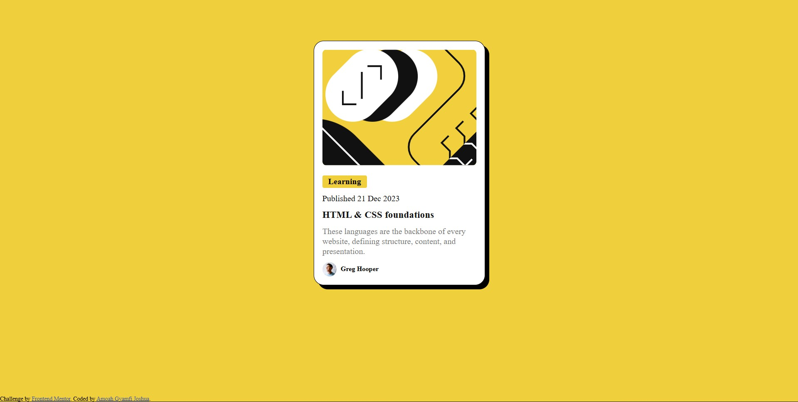

## Table of contents

- [Overview](#overview)
  - [The challenge](#the-challenge)
  - [Screenshot](#screenshot)
  - [Links](#links)
- [My process](#my-process)
  - [Built with](#built-with)
  - [What I learned](#what-i-learned)
  - [Continued development](#continued-development)
- [Author](#author)

## Overview

### The challenge

Users should be able to:

- See hover and focus states for all interactive elements on the page

### Screenshot

### Links

- Solution URL: (https://github.com/Joshua-Gyamfi/blog-preview-card)
- Live Site URL: (https://blog-preview-card-ten-peach.vercel.app/)

## My process

### Built with

- Semantic HTML5 markup
- CSS custom properties
- Flexbox
- CSS Grid
- Mobile-first workflow

### What I learned

Variable and Static fonts, card component design, how to integrate modern tools like figma in building projects.

### Continued development

My next focus will be how to combine these components to build complex websites/apps.

## Author

- Twitter - [@gyamfi-aj](https://www.twitter.com/gyamfi-aj)
- Frontend Mentor - [@Joshua-Gyamfi](https://www.frontendmentor.io/profile/Joshua-Gyamfi)
